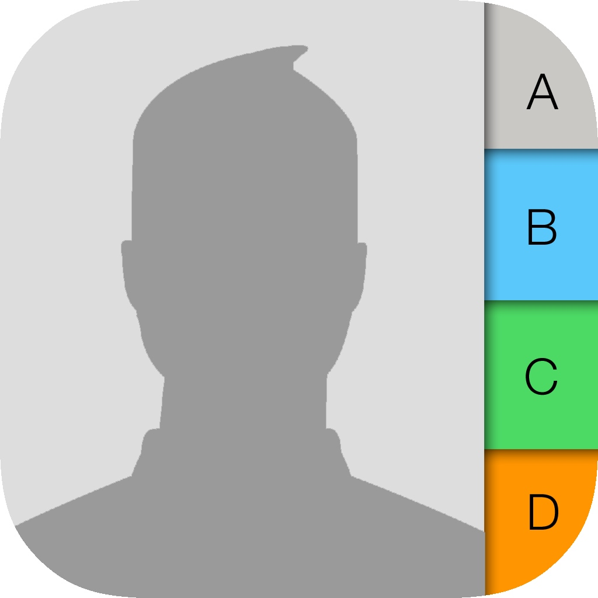
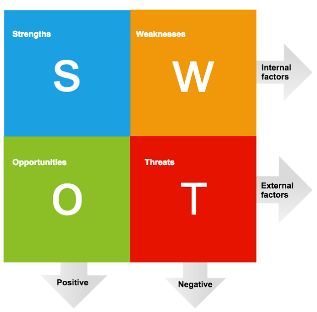

# Requirements
## Introduction
 1. Mini project on ‘PHONEBOOK APPLICATION’ in c language.
2. Index  Introduction.  Aim of the project.  Advantages & Disadvantages.  Software & Hardware details.  Design.  Modules.  Implementation.
3. Introduction  Phonebook is a very simple mini project in C that can help you understand the basic concepts of functions, file handling and data structure. This application will teach you how to add, list, modify or edit, search and delete data to/from the file.  Adding new records, listing them, modifying them and updating, search for contacts saved, and deleting the phonebook records are the basic functions which make up the main menu of this Phonebook application.
4.  Personal information such as name, gender, phone number,email and address are asked while adding a record into the Phonebook. These records can then be modified, listed, searched for and removed.  I have used many functions in this mini project. These functions are easy to understand as their name only signifies their respective operations.
5. Aim of the project  To develop an “Phonebook contact” application using c programming .  This program is very useful now-a-days to store complete information under single contact number.  This program also has options to deletion and modification of the entered contact number.
6. Advantages & Disadvantages  It becomes easy for the user to store complete information( i.e e-mail id, address) about his contact.  It is easy for the user to just search his required contact number by just typing name of the contact.  Some times it becomes difficult to store more contacts(i.e over 150)  It becomes even difficult to store contacts with two or more contact numbers.
## Research
Phonebook project is a very simple tool that helps you understand the basic concepts of creation, file extensions and data structure. This software teaches you how to add, view, edit or modify, receive and delete data from files.
Adding new items, viewing them by logging in, editing and updating, searching for saved contacts and deleting data in the phonebook is one of the main features of the main phonebook application (shown in the main menu below). ).
Personal information, such as name, type, identity, phone number, nationality, email address and address, is required to add a login to the phonebook. You can then edit, view, search and delete this text. It is estimated that there are more than 600 million mobile phone users in the world and the number is also increasing. The success of mobile phones is simply described: they are always there, everywhere. When a trader moves from one place to another, he is doing business without business. If the boy is late returning home, he can tell his parents. If you have a problem with your device, you can seek help along the way. Mobile phones are used for communication and communication between people. Informal meetings (such as going to the bar) are usually arranged on an anonymous and timely map over a mobile phone. In general, there are many ways to use a mobile phone. But there are some problems. Technology decides to reach potential everywhere, anywhere, but its existence does not mean that it can reach all possible respondents! Sharing information about the real world of customers is the way out of this problem. But now mobile user interactions depend on older versions. In particular, the connection between the user and the general user is not sensitive to the context, making it difficult to know when to call and under what circumstances.
## Cost and Features
Cost And Features:

> For Requirements

> For Developing

> For Testing

> For Maintainance

## Defining Our System
    The phonebook application works specifically for tracking people. The Phonebook application contains a set of basic functions for adding, searching, updating, and deleting new contacts. This mini-C phonebook design allows you to perform simple tasks in your phonebook, such as mobile phones. You can add text to the phonebook, find, edit, search, and delete. The concept of file management and data structure is often used in almost all functions in this project.  It uses functions, file management, and data structure. This application provides information on adding, viewing, modifying, receiving, and deleting data from/to files. Adding new entries, browsing them, editing and updating, searching for saved contacts, and deleting contacts in the phonebook is one of the most important services that become the main menu in the phonebook application. When you add anything to your phone book, you will be asked for personal information such as name, gender, first name, phone number, nationality, email address, and address. You can then edit, view, search, and delete this text.
## SWOT ANALYSIS

> Strengths:

.Resource Availability 

.Skill Level

.Track Record

> Weakness:

.Gaps in Implementation

.Deadline

.Completing Process

> Opportunities:

.Skill Advancement

.Infrastructure Betterment

.Emerging Market.

> Threats:

.Competitors

.Academic Work

.Hardware

# 4W&#39;s and 1&#39;H

## Who:

**To The People Who Needs To Track All The Records**

## What:

**Many People Forget The Name Of The People Whome They Want To Get Remember SO It Is Easy For Them With This App To Track All The Record**

## When:

**It Can Be Used At Any Time**

## Where:

**This Problem Is Faced All Over The WOrld.**

## How:

**User Just Need To Fill Some Information And Then It Wil Automatically Saves The Data.**

# High Level  requirements

| **Test ID** | **Description**                                             |**Status**  |    
|-------------|--------------------------------------------------------------|--------------|
|  H_01       |Adding Contact| Implemented|
|  H_02       |Deleting Contact| Implemented|
|  H_03       |Display Contact|  Implemented|
|  H_04       |Modify Contact| Implemented|
|  H_05       |Search Contact| Implemented|

##  Low level requirements

| **Test ID** | **Description**                                             |**Status**  |    
|-------------|--------------------------------------------------------------|--------------|
|  LR_01       |Here we can add the contact in the files.| Implemented|
|  LR_02       | Here we can delete the Contact| Implemented|
|  LR_03       | Here we can Display Contact|  Implemented|
|  LR_04       |Here we can Modify Contact| Implemented|
|  LR_05       |Here we can Search Contact| Implemented|